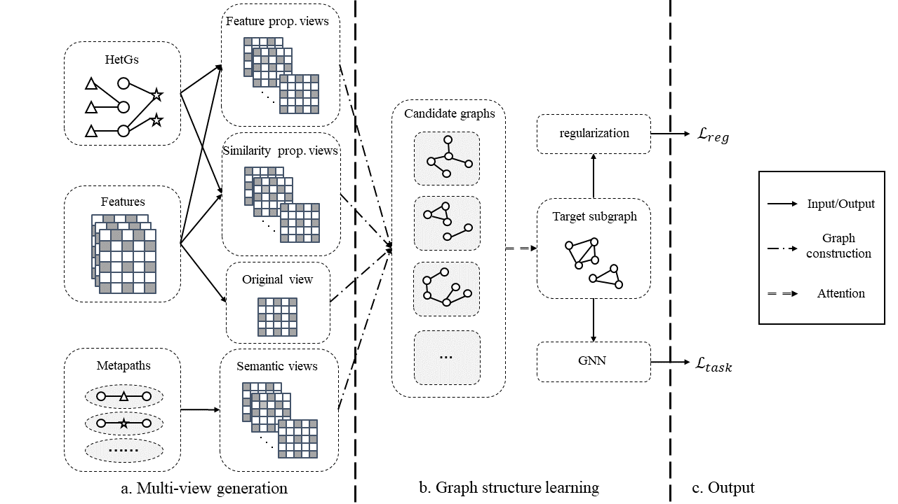

<!-- # Sub-HGNN
Source code of Master's degree thesis: "Subgraph structure learning for Heterogeneous Graph Neural Networks"
-->

# Red-HGNN
Source code of submission: "Relation Decoupled Heterogeneous Graph Neural Network"
 
   
Model scheme:  

# Requirements
1. Python >= 3.6.8
2. Pytorch >= 1.3.0
# Useage
Take "yelp" dataset as an example: python src/train.py
# Reference
This paper and codes are mainly inspired by ["Heterogeneous Graph Structure Learning for Graph Neural Networks"](https://github.com/AndyJZhao/HGSL)
